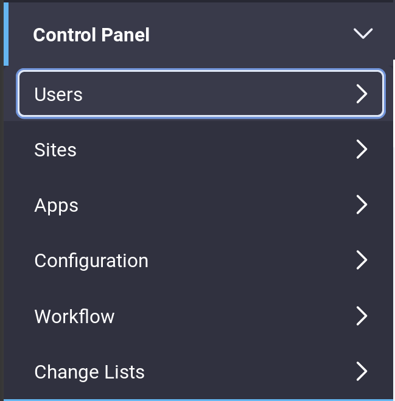

---
output:
  html_document: default
  pdf_document: default
---
# Introduction to Managing Users

Liferay's Control Panel allows you to create Users, Organizations, Sites, configure permissions, plugins among many other features.

The Control Panel is divided into six main areas: Users, Sites, Apps, Configuration, and Workflow. The Users section lets you create and manage Users, Organizations, User Groups, Roles, and Password Policies. Administrators can also enable monitoring to display all the live sections of their users.

Anonymous User: When an administrator clicks on Delete Personal Data for a User, an Anonymous user is created. An Anonymous user is a deactivated User assigned anonymized assets. The Anonymous User is configurable, so the name and configuration details might be different in your virtual instance.

Learn more about Liferay's User Management functionality by reading about Adding and Editing users in the next section.
