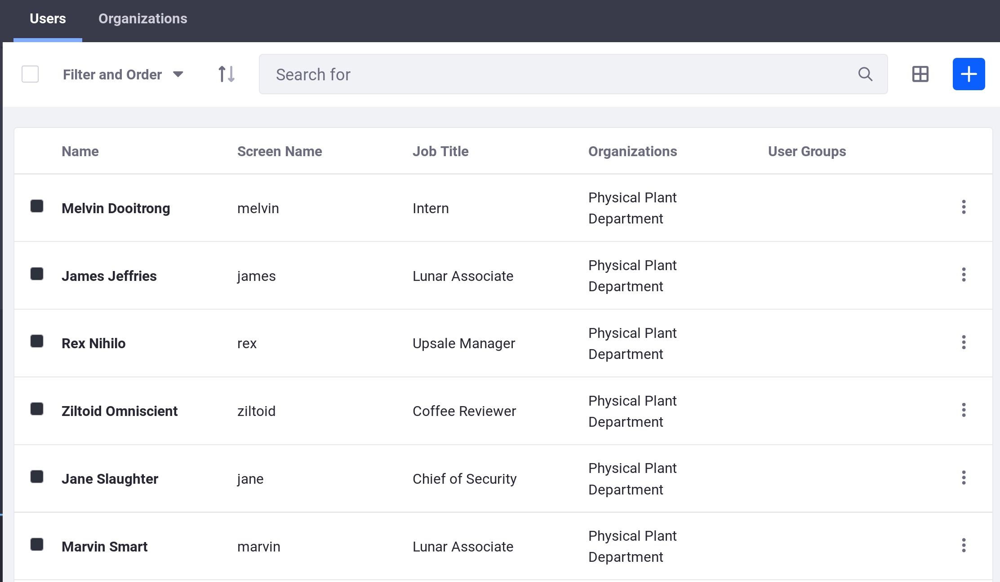
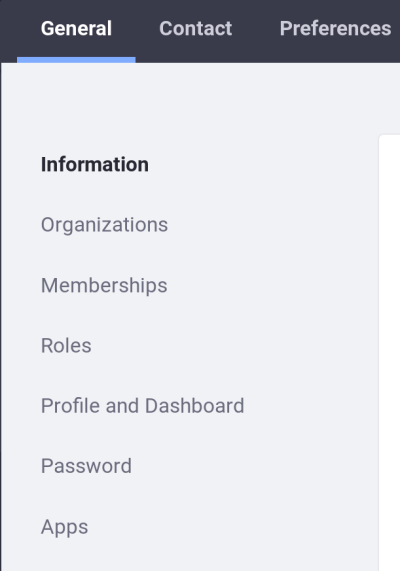
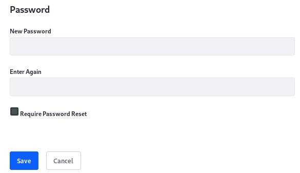
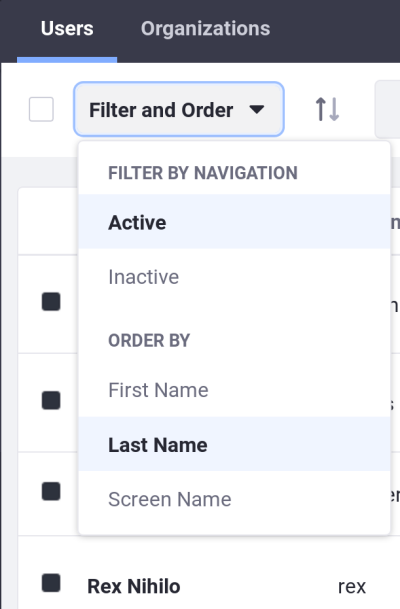

# Adding, Editing, and Deleting Users

Administrative users can add, edit and delete other users at the root of User Management.

## Adding Users

New users can be added in the Product Menu:

1. From the Product Menu, go to _Control Panel → Users → Users and Organizations_.

2. In the Users tab, click the _Add_ button .



3. Click _Save_ after filling the user form to save the newly created user. It is required to provide at least a Screen Name, First Name, Last Name, and Email Address on the User form to allow the form to be submmited. 
Note: A screen name can't contain an ```@``` symbol because it's used in the URL to a User’s private page.

The Add User functionality is split over several independent forms. Saving the first form creates the User, and then you’ll see a success message saying

	Success. Your request completed successfully.

After the first form is submited, a second form will be displayed. By default, the Information section is the first section to be selected. To the left there's a navigation pane where the current section can be switched. The user being added can be configured by going through the different sections. The tabs at the top change the options in the left menu when clicked on. It's necessary to go through the sections for the three tabs on top - General, Contact and Preferences - and fill in all the applicable information.



After that, when the user account is created, a password is automatically generated. If Liferay was correctly installed and a mail server was correctly set up, an email message with the User’s new password will be sent to the User’s email address.

If a mail server wasn't set up, a new password can be manually setted by clicking on the _Password_ item from the General menu. The set up requires that the new password must be provided twice.



## Editing Users

To edit users, click on Users and Organizations in the Control Panel. A list of User will be shown. To change something about a particular user, click the _Actions_ button (Actions) next to that user. Then the next options will be available:

* _Edit_ goes to the Edit User page where any aspect of the User account can be modified, including the screen name, email address, first name, last name, Site, Organization memberships, Roles, etc.

* _Permissions_ can change which Roles have permissions to edit the User.

* _Manage Pages_ allows to configure the personal pages of a User.

* _Impersonate User_ opens a new browser window which loads the site as if you were the User for testing purpouses, to make sure the desired behavior was achived without having to repeatedly log out of the administrator account and into the User’s account.

* _Deactivate_ deactivates the user’s account. The User will still be in the database along with all other Users, although the account will be deactivated, which doesn't allow the User to sign in to the portal. In the Users view, an option for toggle between active and inactive Users is available for filtering. If all the Users are active, this filtering option won’t be displayed.

* _Erase Personal Data_ deletes the User’s personal data.

* _Export Personal Data_ downloads the User’s personal data.



Most of the actions listed above require administrator privilege to be accessed.

## Deleting Users

User deletion should be taken with care. To avoid accidental deletion of Users, a two-step process must be followed: deactivation first, then deletion.

1. Select the User to delete in the Users tab of _Control Panel → Users → Users and Organizations_. In a system with many users, the search functionality helps saving time in finding the desired user to be deleted.

2. Click the _Actions_ menu for the User and select _Deactivate_. A confirmation for user deactivation will show up. Click OK. 
After that, a success message will apear, and the User will not be displayed anymore, even though he wasn't deleted yet.

3. By default, the Users table displays Active users only. By Clicking on _Filter and order_ on top of the table, a dropdown menu appears. By clicking Inactive, the inactive users will show.

4. Click on the Actions menu, then click Delete, to really delete the User. Confirm the User deletion, and then the User will be permanently erased.

**Deactivating a User** disables the User login to the portal. Disabled users also lose privileges in the Sites and pages of the portal, even though the account still exists.

Users can be reactivated by an administrator in the Users table. By making sure that the filter is set to _Inactive users_, click on the Actions menu of the desired user to be reactivated, and select _Activate_. After that, the user is automatically restored to an Active status without a confirmation window.

For more information on additional topics on User Management, follow the link to the next article to keep on reading.


